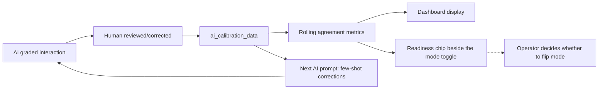

# AI Reviewer Calibration & Trust Lifecycle — Test Walkthrough

A guided tour of the new AI Reviewer calibration features that shipped
across Phases A–D. Walk through this top-to-bottom to validate
everything works end-to-end on your dev box.

> **Time required:** ~30 minutes for the happy path, ~60 minutes if you
> exercise drift detection too.

---

## 0. Prerequisites & Environment

You should already have the following running before starting:

- **Backend** on `http://localhost:3000` (`cd backend; npm run dev`)
- **Frontend** on `http://localhost:5173` (`cd frontend; npm run dev`)
- **`backend/.env`** populated with at least `AI_REVIEWER_USER_ID`,
  `OPENAI_API_KEY`, `ANTHROPIC_API_KEY`, `BOOKSTACK_*`,
  `DATABASE_URL`, and `CRM_DB_*`.

The migration `20260430130000_add_ai_calibration` has been applied
already and stamped in `_prisma_migrations`. To verify:

```powershell
$env:MYSQL_PWD='Thrills0011**'
mysql -u root qtip -e "SHOW TABLES LIKE 'ai_calibration_data'; SHOW COLUMNS FROM forms LIKE 'ai_sample%';"
```

You should see `ai_calibration_data`, `ai_sample_review_pct`, and
`ai_sample_low_score_always`.

### Quick API smoke test

```powershell
# Both should return 401 Unauthorized (route registered, auth gate
# firing). 404 means the backend wasn't restarted.
Invoke-WebRequest -Uri "http://localhost:3000/api/ai-reviewer/inbox" -UseBasicParsing
Invoke-WebRequest -Uri "http://localhost:3000/api/ai-reviewer/health" -UseBasicParsing
```

---

## 1. Pick a Test Form

Go to **Quality → Form Builder** and edit an existing form that has
**AI Reviewer enabled**. The plan was tested against:

```
Form: Tech Ticket Review - Sub-classification, Resolution and Process
Form id: 99016
```

> If you don't have an AI-enabled form yet, edit one and toggle
> **"Enable AI Reviewer"** on the Details step, save, then continue.

Once edited and saved, you should see a new **"Calibration tab"**
button appear above the wizard card.

> **Phase C check:** the button only appears when `form.id` exists AND
> `form.ai_enabled === true`. Try toggling AI off and saving —
> the button should disappear.

---

## 2. Phase A — Verify Schema + Service Layer

### 2.1 New columns + table

```sql
DESCRIBE ai_calibration_data;
DESCRIBE forms;          -- look for ai_sample_review_pct and ai_sample_low_score_always
SHOW INDEX FROM submission_ticket_tasks WHERE Key_name = 'idx_stt_external';
```

### 2.2 Run the calibration unit test

```powershell
cd backend
npx vitest run src/services/__tests__/AICalibrationService.test.ts
```

Expected: **5 / 5 passing** (covers `shouldRouteToReviewInbox` decision
matrix — low-score-always, percentage threshold, 0% / 100% edges,
missing-score handling).

---

## 3. Phase B — End-to-End: Generate an AI Draft → Promote it

### 3.1 Make sure the form is in **Calibrating** mode

Open the form, click **Calibration tab**, confirm the badge in the
**AI Reviewer Mode** card reads `Calibrating` (amber). If it reads
`Trusted`, click **Switch to Calibrating**.

> Calibrating mode = `forms.ai_submit_as_draft = true`. AI submissions
> land as DRAFT for human review.

### 3.2 Run the AI Reviewer against a closed ticket

From a powershell terminal in `backend/`:

```powershell
npx ts-node scripts/ai-review.ts 278984
```

Replace `278984` with the closed ticket id you want to grade. The
output will say:

```
status          : DRAFT (awaiting human approval)
total_score     : (not scored — DRAFT)
```

### 3.3 Open the QA AI Inbox

Browser → **Quality → AI Inbox** (new sidebar entry under Form
Builder / Review Forms).

You should see two cards:

1. **AI Drafts Awaiting Promotion** — the new DRAFT row should appear
   with the ticket id and form name.
2. **Trusted-Mode Samples Awaiting Review** — empty for now (we're in
   Calibrating mode).

Click **Review & Promote** on the new DRAFT row.

### 3.4 Promote the draft

The form opens in `?promoteDraft=<id>` mode. You should see:

- Header reads **"Promote AI Draft"**
- An amber banner explains *Calibrating mode*
- Answers are pre-filled with the AI's responses
- The submit button reads **"Promote to Submitted"**
- The "Save Draft" button is **hidden** (intentional — drafts can't be
  saved over a draft you're promoting)

Edit anything you disagree with. **Tip:** edit at least one answer so
there's a non-empty diff for the calibration data point.

Click **Promote to Submitted**. You should be redirected back to the
AI Inbox with a success toast.

### 3.5 Verify a calibration row landed in the DB

```sql
SELECT id, source, form_id, ticket_id, ai_submission_id, human_submission_id,
       JSON_LENGTH(ai_answers) AS ai_q, JSON_LENGTH(human_answers) AS human_q,
       graded_by, created_at
  FROM ai_calibration_data
 ORDER BY id DESC LIMIT 5;
```

You should see one row with `source = 'qa_promoted_draft'`, both
`ai_submission_id` and `human_submission_id` set (same value), and
`ai_q` / `human_q` matching the form's question count.

### 3.6 Confirm the submission flipped to SUBMITTED

```sql
SELECT id, status, submitted_by, total_score
  FROM submissions
 WHERE id = <the submission id from the inbox row>;
```

Status should be `SUBMITTED`, `submitted_by` should be **your** user
id (not the AI Reviewer user — promotion re-attributes ownership),
`total_score` should be a number > 0.

---

## 4. Phase B (cont.) — Trusted-Mode "Re-audit as Calibration"

### 4.1 Flip the form to Trusted mode

Form Builder → Calibration tab → **Switch to Trusted**.

The badge flips to green `Trusted`. Behind the scenes
`forms.ai_submit_as_draft` is now `false`.

### 4.2 Tune sampling so we route 100% of submissions

In the same Calibration tab, scroll to **Trusted-mode sampling**.
Drag the slider to **100%** and click **Save sampling settings**. This
forces every Trusted AI submission into the QA inbox so we can test
the flow without rolling random dice.

### 4.3 Run the AI on another ticket

```powershell
npx ts-node scripts/ai-review.ts 279434
```

Output should show:

```
status          : SUBMITTED
total_score     : <some number>
```

### 4.4 Open the AI Inbox again

Now the second card — **Trusted-Mode Samples Awaiting Review** — has
the new submission with a **"Random sample"** badge (or **"Below cap"**
if the score happened to be below the form's critical-fail percent).

Click **Re-audit**.

### 4.5 Re-audit overlay

The form opens in `?calibrationOverlayFor=<id>` mode:

- Header reads **"Calibration Re-audit"**
- Banner explains **Trusted-mode sample**
- Answers are pre-filled with the AI's submitted values
- Submit button reads **"Save Calibration"**

Change at least one answer, click **Save Calibration**. You should be
redirected back to the inbox with a success toast.

### 4.6 Verify the second calibration row

```sql
SELECT id, source, ai_submission_id, human_submission_id, graded_by
  FROM ai_calibration_data
 ORDER BY id DESC LIMIT 5;
```

The new row should have `source = 'qa_sample_review'` with **two
different** submission ids (`ai_submission_id` is the AI's; the human
re-audit created a new submission and `human_submission_id` points to
it). The AI's original submission is left in place as the system of
record.

```sql
-- Sanity check: AI's submission unchanged
SELECT id, status, submitted_by FROM submissions
 WHERE id = <ai_submission_id from above>;

-- New human submission exists
SELECT id, status, submitted_by, total_score FROM submissions
 WHERE id = <human_submission_id from above>;
```

---

## 5. Phase C — AI Reviewer Management Page

AI configuration no longer lives inside the Form Builder. Open
**Quality > AI Reviewer** in the sidebar. You should see one row per
AI-enabled form with:

- Form name, type, version
- A **Mode** badge — `Calibrating` (amber) when `ai_submit_as_draft = 1`,
  `Trusted` (green) otherwise
- Rolling agreement, sample count, last-30-day count

Click **Manage** on the form you've been testing. The detail page has
two areas:

### 5.1 Settings card (in-place save, no version bump)

1. **Save AI submissions as DRAFT** toggle — flips Calibrating /
   Trusted instantly. Hitting this calls `PATCH
   /api/ai-reviewer/calibration/forms/:formId/settings` and the page
   re-renders the badge in the header.
2. **AI Reviewer Guidance** textarea + **Save guidance** button.
3. **Trusted-mode sampling** — random-sample percentage slider and
   low-score-always switch + **Save sampling** button.

Verify each save:
- Reloads the same value after a hard refresh.
- Does NOT change the form's `version` column in the `forms` table.

```sql
SELECT id, version, ai_submit_as_draft, ai_review_guidance IS NOT NULL AS has_guidance,
       ai_sample_review_pct, ai_sample_low_score_always
  FROM forms WHERE id = <form_id>;
```

### 5.2 Calibration metrics

Below the Settings card, the read-only metrics panel shows:

1. **Rolling Agreement (last 50)** — overall agreement percentage
   (green ≥ 90, amber ≥ 80, red below), sample size, oldest data
   point, last 30 days count.
2. **Drift snapshot** — a bar chart comparing the last 50 to a
   longer window (rendered when sample size is sufficient).
3. **Per-question agreement** bars sorted lowest first; anything
   below 80% colored amber.
4. **Recent calibration data points** — each row with diffed
   answers (`AI: yes  Human: no` style lines).

Calibration data points are accumulated only by the natural flow:
promoting AI drafts (Calibrating mode) and re-auditing AI submissions
that land in the QA review inbox (Trusted mode). There is no manual
import of historical submissions.

#### How the closed loop works

Every promoted draft / sample re-audit captures the diff between the AI's
answers and the human's. Those diffs feed two things:



- **Prompt-side feedback** (Piece A): on every AI run, `AIReviewerService`
  asks `aiCalibrationService.getRecentCorrections(formId)` for the most
  recent diffs (one per question, newest wins) and injects them into the
  system prompt under a `LEARNED CORRECTIONS FROM HUMAN REVIEWERS`
  section. The corrections payload is recency-weighted and capped by
  character budget (~6000 chars by default), not row count, so as the
  calibration corpus grows the model always sees the freshest lessons
  without unbounded prompt growth.
- **Readiness signal** (Piece B): when rolling agreement crosses
  configured thresholds (≥ 90% across ≥ 20 samples → "ready to promote",
  < 80% across ≥ 10 last-30d samples in Trusted mode → "consider
  demote"), the AI Reviewer detail page shows a status chip next to the
  Calibrating/Trusted badge. The mode flip itself is still a manual
  click on the existing Settings toggle — the system only suggests.

### 5.3 Form Builder side

Open the form in **Form Builder → Details**. The AI section now
contains only the **Enable AI Reviewer** toggle plus a link back to
**Quality > AI Reviewer** when AI is on. There are no guidance,
draft, sampling, or calibration controls in the form-builder
anymore — they all live on the management page.

### 5.4 Manual training run

The "Run AI manually" card sits at the top of the Manage page so
QA admins can grade individual interactions on demand without
asking a developer to hit the API.

**What it does**

- Picks the form's AI Reviewer (the same one cron jobs will use
  later) and runs it against a single ticket, task, or
  conversation you specify by id.
- Submission lands wherever the form is configured to land it:
  - **Calibrating** mode (`Save AI submissions as DRAFT` on) →
    DRAFT in the AI Inbox, ready for promote / overlay.
  - **Trusted** mode (toggle off) → SUBMITTED with a score; if
    the submission falls in the random sample window or under
    the critical-fail cap it also shows up in the AI Inbox for
    re-audit.
- The card invalidates the calibration metrics, recent diffs,
  AI Inbox, and AI Reviewer list queries on success so the rest
  of the page reflects the new data immediately.

**Allowed kinds by form `interaction_type`**

| Form interaction type | Ticket | Task | Conversation |
|-----------------------|:------:|:----:|:------------:|
| `TICKET`              |  ✅    |  ❌  |  ❌          |
| `CALL`                |  ❌    |  ❌  |  ✅          |
| `UNIVERSAL`           |  ✅    |  ✅  |  ✅          |
| `EMAIL` / `CHAT`      |  ❌    |  ❌  |  ❌ (no adapter yet) |

Disallowed kinds appear in the radio group but greyed out, with a
tooltip explaining why. If every kind is disabled (e.g. EMAIL
form), the card surfaces an amber notice instead of the run UI.

**Step-by-step**

1. Open **Quality > AI Reviewer**, then click **Manage** on the
   form you want to train.
2. In the **Run AI manually** card, pick **Ticket**, **Task**, or
   **Conversation**.
3. Type the id (positive integer for ticket/task, conversation
   GUID for calls) and click **Run**.
4. The button switches to "Running… this can take 30–60s" while
   the LLM round-trips. You'll get a toast on success or failure.
5. The result strip below the button shows the new submission id,
   plus a deep-link button:
   - **Review draft** → opens the audit page in promote mode so
     you can edit the AI's answers and Save as Final to record a
     calibration data point (Calibrating mode only).
   - **Open submission** → opens the standard submission detail
     page (Trusted mode); from there you can use **Re-audit as
     calibration** to overlay a human grade.
6. Watch the **Calibration metrics** panel below — once a row
   lands in `ai_calibration_data`, the rolling agreement,
   per-question agreement, and recent diffs refresh
   automatically.

**Things that should NOT happen (regressions)**

- A new form version on the form (this card never touches the
  rubric).
- A second submission silently created if you click Run twice on
  the same id while a previous run is in flight (the button
  disables itself while pending).
- The selected radio kind staying highlighted after you switch
  the form to a more-restrictive interaction type — the card
  snaps back to the first allowed kind.

**Troubleshooting**

- `404 Ticket … not found in CRM` — the id doesn't exist in CRM.
  Double-check the number; the AI Reviewer reads CRM live.
- `422 … is not closed` — the AI Reviewer only grades closed
  interactions today. Wait for the agent to close the ticket /
  task, or use a different one.
- `404 Conversation … has no transcript` — PhoneSystem hasn't
  finished transcribing the call yet. Try again once the
  recording shows a transcript in the call viewer.
- `403 Form … is not AI-enabled` — open the form in Form
  Builder, flip **Enable AI Reviewer** on, and Save.

### 5.5 What the AI is currently learning from

Below the **Run AI manually** card you'll find a new
**What the AI is currently learning from** panel. It mirrors exactly
what `AIReviewerService` injects into the system prompt on the next
run:

- One row per question; only diffs (AI ≠ human); newest correction wins
  per question_id.
- Recency-weighted, capped by character budget (~6000 chars by default).
- Each row shows the question text, AI vs human values, and the source
  ticket / date so you can audit the lesson.

Behaviors to verify:

- **Empty state**: a fresh AI-enabled form with no calibration data
  shows the "No corrections injected yet" message. Promote one draft
  with at least one edit; refresh the page; the diff appears here AND
  in the prompt of the next run (visible in the backend `[AI REVIEWER]
  injected N learned corrections` log line).
- **Per-question dedup**: promote the same question twice on different
  tickets with different human edits — only the most recent one shows.
- **Budget cap**: with many corrections accumulated, scrolling the panel
  will show the full set; the prompt only includes whatever fits in the
  budget. The backend log line tells you exactly how many were used.

### 5.6 Readiness chip beside the mode toggle

The header of the AI Reviewer detail page renders a small status chip
next to the existing `Calibrating` / `Trusted` badge. It is advisory
only — the actual mode flip is still the manual toggle in the Settings
card.

| Recommendation | When it shows | Color |
|---|---|---|
| `PROMOTE_TO_TRUSTED` | Calibrating mode + ≥ 90% rolling agreement + ≥ 20 samples | Green |
| `CONSIDER_DEMOTE` | Trusted mode + < 80% agreement + ≥ 10 last-30d samples | Amber |
| `INSUFFICIENT_DATA` | Fewer than 20 samples have been collected | Slate |
| `STAY_CALIBRATING` | None of the above (steady-state) | Hidden |

Tooltip on the chip explains the threshold and shows the current
values. Thresholds are constants for v1 (no schema changes).

---

## 6. Phase D — Eval CLI + Drift Visibility

### 6.1 Run the per-form rolling eval against the calibration corpus

From `backend/`:

```powershell
npx ts-node scripts/ai-eval.ts --from-db --form-id 99016
```

This:
1. Loads each unique ticket from `ai_calibration_data` for form 99016
   (newest row per ticket wins).
2. Re-runs `aiReviewerService.analyzeTicket()` on each one against
   the Anthropic provider by default.
3. Computes overall + per-ticket agreement against the human answers.
4. Prints a summary report.

Add `--providers anthropic,openai` to run both providers side-by-side,
or `--db-limit 10` to cap the eval set.

### 6.2 Drift snapshot in the Calibration tab

The bar chart on the Calibration tab compares the recent rolling
window (default last 50) against a longer one (last 200). When you
have very few rows, both bars will look similar. As you accumulate
more calibration data, divergence between the two bars is your drift
signal:

| Recent vs Long-term | Interpretation |
|---|---|
| Recent ≈ Long-term | Stable |
| Recent < Long-term | **Drifting** — investigate KB changes or prompt edits |
| Recent > Long-term | Improving (often from a recent prompt fix) |

Bars are color-coded by absolute agreement (green ≥ 90%, amber ≥ 80%,
red below).

---

## 7. Cleanup / Rollback

### Roll back the test rows

If you want to wipe the calibration rows you created during this
walkthrough:

```sql
DELETE FROM ai_calibration_data WHERE form_id = <your form id>;
```

### Roll back submissions you created

```sql
SELECT id, status, total_score FROM submissions
 WHERE form_id = <your form id>
 ORDER BY id DESC LIMIT 10;

-- Then for each id you want gone:
DELETE FROM submission_answers WHERE submission_id = <id>;
DELETE FROM submission_metadata WHERE submission_id = <id>;
DELETE FROM submission_ticket_tasks WHERE submission_id = <id>;
DELETE FROM submissions WHERE id = <id>;
```

---

## 8. Things to Look For (Pass/Fail Checklist)

| # | Behavior | Pass criteria |
|---|---|---|
| 1 | `GET /api/ai-reviewer/inbox` while logged in | Returns JSON with `drafts_awaiting_promotion` and `samples_awaiting_review` arrays |
| 2 | `GET /api/ai-reviewer/forms` while logged in | Returns `{ items: [...] }` with one row per AI-enabled active form, each containing rolling-agreement summary |
| 3 | AI run on Calibrating-mode form | Submission stored as DRAFT, no `total_score` |
| 4 | Promoting an AI draft | Status flips to SUBMITTED, score calculated, calibration row added with `source='qa_promoted_draft'` |
| 5 | AI run on Trusted-mode form | Submission stored as SUBMITTED with score |
| 6 | Trusted-mode sample re-audit | New human submission created (separate from AI's), AI's submission unchanged, calibration row added with `source='qa_sample_review'` |
| 7 | AI Reviewer page — Mode toggle | Updates `forms.ai_submit_as_draft` in place; **does NOT bump `forms.version`** |
| 8 | AI Reviewer page — Guidance save | Updates `forms.ai_review_guidance` in place; does NOT bump `forms.version` |
| 9 | AI Reviewer page — Sampling settings | Persist between page loads; do NOT bump `forms.version` |
| 10 | AI Reviewer page — Per-question bars | Below-80% questions called out in amber |
| 11 | AI Reviewer page — Drift snapshot | Both bars render once you have ≥ 1 calibration row with both AI and human answers |
| 12 | `--from-db --form-id <id>` CLI flag | Loads rows from `ai_calibration_data` instead of `golden.json` |
| 13 | Re-audit submission detail badge | Submission detail page on a SUBMITTED AI submission shows a **"Re-audit as calibration"** button |
| 14 | Form Builder Details tab | Shows ONLY the Enable AI Reviewer toggle; no guidance, draft, sampling, or calibration controls remain |
| 15 | Closed-loop prompt injection | After a calibration row exists with both `ai_answers` and `human_answers`, the next AI run logs `[AI REVIEWER] injected N learned corrections (~X chars) for form_id=…` to the backend stdout |
| 16 | Learned corrections panel | "What the AI is currently learning from" lists the same diffs that get injected, one row per question, newest correction wins |
| 17 | Readiness chip — promote | With calibrating mode + ≥ 20 samples + ≥ 90% rolling agreement, the chip turns green and reads "Ready to promote to Trusted" |
| 18 | Readiness chip — demote | With trusted mode + ≥ 10 last-30d samples + < 80% agreement, the chip turns amber and reads "Consider switching back to Calibrating" |

---

## 9. Common Pitfalls

- **404 on `/api/ai-reviewer/inbox`**: backend wasn't restarted after
  pulling in the new routes. Kill all `node.exe` for backend and
  re-run `npm run dev`.
- **403 on `/api/ai-reviewer/draft/:id`**: this endpoint *only* exposes
  drafts owned by `AI_REVIEWER_USER_ID`. If you somehow promoted a
  draft created by your own user via the inbox, the endpoint will
  refuse — by design.
- **Form missing from `Quality > AI Reviewer`**: the form must be
  saved AND have `ai_enabled = true` AND `is_active = 1`. New unsaved
  forms and old inactive versions are filtered out of the list.
- **Sidebar item not showing**: only role 1 (Admin) and role 2 (QA)
  see `AI Reviewer`. Verify your user role.
- **Drift snapshot empty**: you need at least one calibration row
  where both `ai_answers` and `human_answers` are populated, which
  means at least one promoted draft or sample re-audit on this form.
- **Inbox shows 0 samples in Trusted mode**: confirm `ai_sample_review_pct`
  is > 0 (or `ai_sample_low_score_always = 1` and the AI submission's
  score is below the form's `critical_cap_percent`).

---

## 10. Phase E — Industry Parity Runbooks

These runbooks cover the industry-parity work added on top of A–D:
absorb lifecycle, golden-set + regression eval, empirical confidence
calibration, Cohen's kappa, drift detection, and per-form cost budgets.

### 10.1 Migration check (consolidated `ai_industry_parity` migration)

```powershell
$env:MYSQL_PWD='Thrills0011**'
mysql -u root qtip -e "SHOW COLUMNS FROM forms LIKE 'ai_calibration_auto_absorb_days'; SHOW COLUMNS FROM forms LIKE 'ai_monthly_cost_budget_usd'; SHOW COLUMNS FROM forms LIKE 'ai_disagreement_route_threshold'; SHOW COLUMNS FROM ai_calibration_data LIKE 'absorbed_at'; SHOW COLUMNS FROM submissions LIKE 'ai_calibrated_confidence'; SHOW TABLES LIKE 'ai_golden_set'; SHOW TABLES LIKE 'ai_calibration_map'; SHOW TABLES LIKE 'ai_eval_runs';"
```

All eight rows should come back populated. If any are missing run
`npx prisma migrate deploy` from `backend/`.

### 10.2 Absorb a learned correction (manual)

The Learned Corrections panel on the per-form AI Reviewer page now has
a **Mark Absorbed** button on each row. Click it → enter a reason
(typically `tech-ticket-process pack v3` or whichever rule pack you
just edited). The row immediately disappears from the few-shot list
and stops costing prompt tokens, but stays counted in kappa stats.

Toggle **Show Absorbed** at the top of the panel to reveal the absorbed
rows in a muted style — useful for auditing what's been "promoted" out
of the few-shot path.

> **When to absorb:** any time the AI got a correction wrong, you
> investigate, and the lesson now lives in a rule pack or
> `ai_review_guidance`. Leaving the correction unabsorbed wastes
> prompt tokens duplicating advice the rule pack already gives.

### 10.3 Auto-absorb sweep

Every server boot and once per 24 hours after that, the sweep finds
`ai_calibration_data` rows that are older than the per-form
`ai_calibration_auto_absorb_days` (default **180**) and stamps
`absorbed_reason = 'auto-absorbed (>N days)'`. Boot log:

```
[AI REVIEWER] absorb sweep: N rows auto-absorbed
[AI REVIEWER] absorb sweep: form_id=99016 absorbed=12 cutoff=180d
```

If the line is missing, `runAbsorbSweepOnBoot` failed silently; check
`backend/logs/` for the matching error message.

### 10.4 Form-level calibration reset (the only legitimate "wipe")

A form's rubric materially changed and the existing calibration data
no longer reflects how questions should be answered? Reset just that
form:

```powershell
# Replace YOUR_TOKEN and 99016. confirm:'RESET' is required.
Invoke-RestMethod -Method Post -Uri "http://localhost:3000/api/ai-reviewer/forms/99016/calibration/reset" `
  -Headers @{ 'Cookie' = 'session=YOUR_TOKEN' } `
  -ContentType 'application/json' `
  -Body '{"confirm":"RESET","reason":"Rubric overhaul 2026-Q2 — old grades no longer apply."}'
```

Soft-archives every row for that form (`in_rolling_set = false`,
notes prefixed with `[FORM_RESET <date> <user>]`). Other forms are
untouched. Restricted to QA admin role.

### 10.5 Golden set workflow

The golden set is the held-out source of truth for regression eval.

**Auto-seeder.** Daily background job promotes any submission where
the AI's answers were left unchanged by the human reviewer AND the
total score is at or above `critical_cap_percent`. Boot log:

```
[AI REVIEWER] golden set seeder: N candidates
```

**Manual seed.** From `backend/`:

```powershell
npm run eval:seed-golden
```

One-shot backfill that scans every eligible submission. Safe to re-run.

**Manage the set.** The Golden Set card on the per-form AI Reviewer
page lists the active golden submissions with archive / restore
buttons. Use Archive when a golden item turns out to be wrong (graded
by a human you no longer trust, ticket data changed, etc.). Restore
brings it back without re-seeding.

### 10.6 Regression eval (kappa CI gate)

Every PATCH to a form's rule packs or `ai_review_guidance` triggers
`runGoldenEval` automatically. The Latest Eval Run card on the per-form
page shows:

- **Overall kappa** across every evaluated golden submission.
- **Δ vs previous** (red when negative).
- **Status: PASS / REGRESSION** — REGRESSION when Δ < `-0.03` (env
  `AI_GOLDEN_DELTA_THRESHOLD`).

Manual trigger from `backend/`:

```powershell
npm run eval:golden -- --form 99016
```

Exits non-zero on regression — wire to your CI pipeline if you want
a deploy-blocking gate.

The "View per-submission results" drawer shows the per-question
golden vs. AI grade, plus the calibrated confidence, KB citations,
timeline, and observations the AI produced for that ticket — enough
to diagnose a regression at the question level without re-running
the eval.

### 10.7 Empirical confidence calibration

The AI's nominal `overall_confidence` is often miscalibrated (typically
over-confident at 0.7–0.9 and under-confident at the extremes). The
calibration map fixes that by isotonic-regressing nominal vs. actual
agreement on historical samples.

**Fit a new map.** Open the Calibration Map panel on the per-form page.
You need **≥ 200 reviewed submissions** for a meaningful fit. Click
**Preview fit** to see the proposed bins (nominal range → calibrated
value → sample count); click **Fit map** to persist it as the next
version with `is_active = 0`. **Activate** flips it to live.

**Active map effects.**
1. New submissions get both `ai_overall_confidence` (nominal) and
   `ai_calibrated_confidence` (post-map) persisted.
2. Inbox routing (`ai_sample_low_confidence_threshold`) compares
   against the calibrated value when a map is active, falling back to
   nominal when no map exists.
3. Boot log: `[AI REVIEWER] calibrator: N form(s) have an active calibration map`.

### 10.8 Cohen's kappa as the readiness signal

Raw agreement percentage is replaced by Cohen's kappa everywhere it
gates a behavior. The Calibration Metrics panel shows κ next to raw
agreement; the Readiness chip recommends promote / demote based on
kappa thresholds:

| Readiness | Threshold |
|---|---|
| Promote → Trusted | κ ≥ 0.6 over ≥ 20 samples |
| Consider demoting | κ < 0.4 over ≥ 10 last-30d samples |
| Insufficient data | < 20 samples |

Per-question kappa surfaces in the same panel. Anything below 0.4 is
a candidate for a rule-pack edit or guidance update.

### 10.9 Disagreement-driven sampling

Set the **Per-question disagreement route threshold** in the Trusted-
mode sampling section (try `0.4` first). When ANY question on a
SUBMITTED AI submission has rolling per-question kappa below this
floor, the submission is routed to the QA inbox with
`routing_reason = 'low_question_agreement'` — even when its overall
confidence and score look fine. The 5-minute in-memory cache means a
single inbox load doesn't fan out to one per-form metrics query per
submission.

### 10.10 Drift detection

Daily background job snapshots per-form: submission count, average
total_score, average nominal confidence, average calibrated
confidence, and score variance. The 90-day history lives in
`backend/data/drift/<form-id>.json` (low-cardinality time series, no
new SQL table).

Anything > **2 SD** from the trailing 12-week baseline shows up as an
amber **Drift** badge on the per-form page header (tooltip lists the
metric, today's reading, and the z-score). Boot log:

```
[AI REVIEWER] drift sweep: N forms snapshotted, M alerts
```

When the badge fires, the playbook is:
1. Eyeball recent submissions for upstream changes (CRM ticket length
   spike, new note types, classification mix shift).
2. Compare current rule packs against the version that produced the
   baseline kappa.
3. If real, re-run `npm run eval:golden` to confirm whether kappa
   actually dropped, or whether the input mix shifted but the AI is
   still grading well.

### 10.11 Per-form monthly cost budget

Set **Monthly cap (USD)** in the per-form Settings card. The
`AIReviewerCostGuard` runs before every LLM call:

| MTD vs cap | Behavior |
|---|---|
| < 80% | Allowed, gauge green. |
| 80% – 99.9% | Allowed, gauge amber, warn logged. |
| ≥ 100% | Blocked. AIReviewerService throws `BUDGET_EXCEEDED` so the route routes the submission to a human reviewer with an explanation. |

The Budget gauge under the budget input (and the page header chip)
shows live MTD vs. cap. Resets at the first day of each UTC month.

> **Budget exhaustion runbook:** when the page shows "Budget hit",
> either raise the cap (Settings card) or wait for the month to roll
> over. Submissions during the blocked window were routed to humans
> — they are not lost, they just took a different path. Spot-check
> the QA inbox to confirm.

### 10.12 Smoke checks

After any deploy, the following should appear in `backend/logs/`
within ~5 seconds of boot:

```
[AI REVIEWER] system prompt v2.0 active (timeline + observations + confidence)
[AI REVIEWER] absorb sweep: N rows auto-absorbed
[AI REVIEWER] golden set seeder: N candidates
[AI REVIEWER] calibrator: N form(s) have an active calibration map
[AI REVIEWER] drift sweep: N forms snapshotted, M alerts
[AI REVIEWER] cost guard: N AI-enabled form(s) have monthly budgets
```

The per-form AI Reviewer page header should also show: prompt revision
chip, readiness chip, drift badge, budget chip. Missing any chip means
its data source returned an error — check the corresponding API route
in the Network tab.
