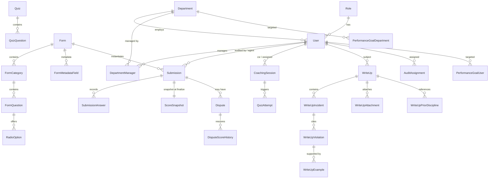

# Database schema

High-level overview of the QTIP database. Source of truth is
[`backend/prisma/schema.prisma`](../backend/prisma/schema.prisma); models
and enums are auto-generated into `backend/src/generated/prisma/` (see
review item #96 for the output-location rationale). When the Prisma schema
changes, update this file in the same PR.

> [`database_schema_updates.md`](./database_schema_updates.md) remains the
> **change log** for schema deltas and the process for generating
> migrations. This file is the **reference** — what tables exist, how they
> relate, and which domain they belong to.

---

## Domains

Models are grouped by functional domain. Every model maps to one table
(Prisma `@@map` when the DB name differs from the Prisma model name).

### Identity & access

| Prisma model                 | DB table                    | Role                                                 |
| ---------------------------- | --------------------------- | ---------------------------------------------------- |
| `Role`                       | `roles`                     | Admin / QA / Agent / Trainer / Manager / Director    |
| `Department`                 | `departments`               | Org units; users belong to one.                      |
| `DepartmentManager`          | `department_manager`        | Many-to-many (managers ↔ departments they cover).   |
| `User`                       | `users`                     | Every human + service account.                       |
| `ListItem`                   | `list_items`                | Enumerated pick-lists (coaching purposes, etc.).     |
| `AuthLog`                    | `auth_log`                  | Sign-in / sign-out trail.                            |
| `AuditLog`                   | `audit_log`                 | Application-level audit trail.                       |
| `AgentActivity`              | `agent_activity`            | Cached agent last-seen / login metadata.             |

### Quality — forms

| Model                        | Role                                                 |
| ---------------------------- | ---------------------------------------------------- |
| `Form`                       | Top-level form definition.                           |
| `FormMetadataField`          | Submission-level fields (date, call id, …).          |
| `FormCategory`               | Scored sections.                                     |
| `FormQuestion`               | Questions inside categories.                         |
| `RadioOption`                | Radio / checkbox options, with per-option score.     |
| `FormQuestionCondition`      | Conditional-display rules.                           |

### Quality — submissions & disputes

| Model                        | Role                                                          |
| ---------------------------- | ------------------------------------------------------------- |
| `Submission`                 | One audit of one agent on one form.                           |
| `SubmissionMetadata`         | Per-submission metadata-field answers.                        |
| `SubmissionCall`             | Link table to call records being audited.                     |
| `SubmissionAnswer`           | Per-question answers (joined to `FormQuestion`).              |
| `FreeTextAnswer`             | Free-text answers stored separately for large payloads.       |
| `ScoreSnapshot`              | Immutable scoring snapshot captured at finalize time.         |
| `Dispute`                    | Dispute filed by an agent against a submission.               |
| `DisputeScoreHistory`        | Before/after scoring history for dispute adjustments.         |

### Coaching & training

| Model                        | Role                                                          |
| ---------------------------- | ------------------------------------------------------------- |
| `CoachingSession`            | Scheduled / delivered coaching session.                       |
| `Course`                     | Training course definitions.                                  |
| `Quiz`                       | Quiz definitions tied to a course or topic.                   |
| `QuizQuestion`               | Questions within a quiz.                                      |
| `QuizAttempt`                | An attempt at a quiz (agent + session).                       |
| `TrainingResource`           | Uploaded training resource (PDF, video link, etc.).           |

### Write-ups (performance warnings)

| Model                        | Role                                                          |
| ---------------------------- | ------------------------------------------------------------- |
| `WriteUp`                    | Verbal / written / final warning header.                      |
| `WriteUpIncident`            | One incident inside a write-up.                               |
| `WriteUpViolation`           | Policy violations linked to an incident.                      |
| `WriteUpExample`             | Examples supporting a violation (source: audit / free-text).  |
| `WriteUpPriorDiscipline`     | Prior discipline referenced in this write-up.                 |
| `WriteUpAttachment`          | File attachments.                                             |

### Performance goals

| Model                         | Role                                                         |
| ----------------------------- | ------------------------------------------------------------ |
| `PerformanceGoal`             | Goal header (QA score / audit rate / dispute rate).          |
| `PerformanceGoalUser`         | Goal targets per user.                                       |
| `PerformanceGoalDepartment`   | Goal targets per department.                                 |

### Audit assignment

| `AuditAssignment`             | Scheduled audit for a QA / Trainer / Manager.                |

### Reporting / analytics / imports

| Model                         | Role                                                         |
| ----------------------------- | ------------------------------------------------------------ |
| `MetricDefinition`            | Canonical metric spec.                                       |
| `MetricDepartment`            | Metric ↔ department attachment.                              |
| `MetricThreshold`             | Per-metric threshold bands.                                  |
| `ReportDefinition`            | Saved-report definition (builder).                           |
| `ReportDefinitionDepartment`  | Report ↔ department attachment.                              |
| `CallActivityRaw`             | Raw call metadata import.                                    |
| `SalesMarginRaw`              | Raw sales + margin import.                                   |
| `LeadSalesMarginRaw`          | Raw lead sales import.                                       |
| `LeadSourceRaw`               | Raw lead-source import.                                      |
| `TicketTaskRaw`               | Raw ticket/task import.                                      |
| `EmailStatsRaw`               | Raw email stats import.                                      |
| `EntityRaw`                   | Generic raw entity import.                                   |
| `ImportLog`                   | One import run.                                              |
| `RawTableConfig`              | Configuration for raw-import tables.                         |
| `Call`                        | Normalized call record.                                      |

### Insights / KPI engine

| Model                         | Role                                                         |
| ----------------------------- | ------------------------------------------------------------ |
| `IeDimDate`                   | Date dimension.                                              |
| `IeDimDepartment`             | Department dimension (insights-local copy).                  |
| `IeDimEmployee`               | Employee dimension.                                          |
| `IeKpi`                       | KPI rollup.                                                  |
| `IeKpiThreshold`              | KPI threshold bands.                                         |
| `IePage`                      | Insights page registry.                                      |
| `IePageRoleAccess`            | Page-level role ACL (drives `<RequireInsightsAccess>`).      |
| `IePageUserOverride`          | Per-user override.                                           |
| `IeIngestionLog`              | Worker run log.                                              |
| `IeIngestionLock`             | Advisory lock so two workers don't stomp each other.         |
| `IeConfig`                    | Insights feature flags.                                      |
| `BusinessCalendarDay`         | Shared business-day calendar.                                |

---

## ER diagram — core relationships

Top-level view; per-domain detail is best viewed directly from
`schema.prisma` in an editor with Prisma intellisense.

Render the diagram by opening this file in any Mermaid-aware Markdown
viewer (VS Code + Mermaid extension, GitHub, GitLab, most wikis).

---

## Regenerating this file

Until a prisma-to-markdown generator is wired into CI, the process is
manual but mechanical:

1. Run `rg "^model |^enum " backend/prisma/schema.prisma` to list every
   model and enum.
2. Diff the output against the tables in §Domains. Add missing rows,
   delete dropped ones.
3. If a relationship added in the PR changes the core picture, update
   the ER diagram in the same commit.

A CI check that fails when the counts diverge is the right long-term
solution — track it in `performance_goals_implementation_status.md`-style
follow-up if you don't do it here.

---

## Related documents

- [`database_schema_updates.md`](./database_schema_updates.md) — change-log / process
- [`multiple_database_connections.md`](./multiple_database_connections.md) — primary vs secondary pool
- [`backend/prisma/migrations/README.md`](../backend/prisma/migrations/README.md) — migration naming rules
