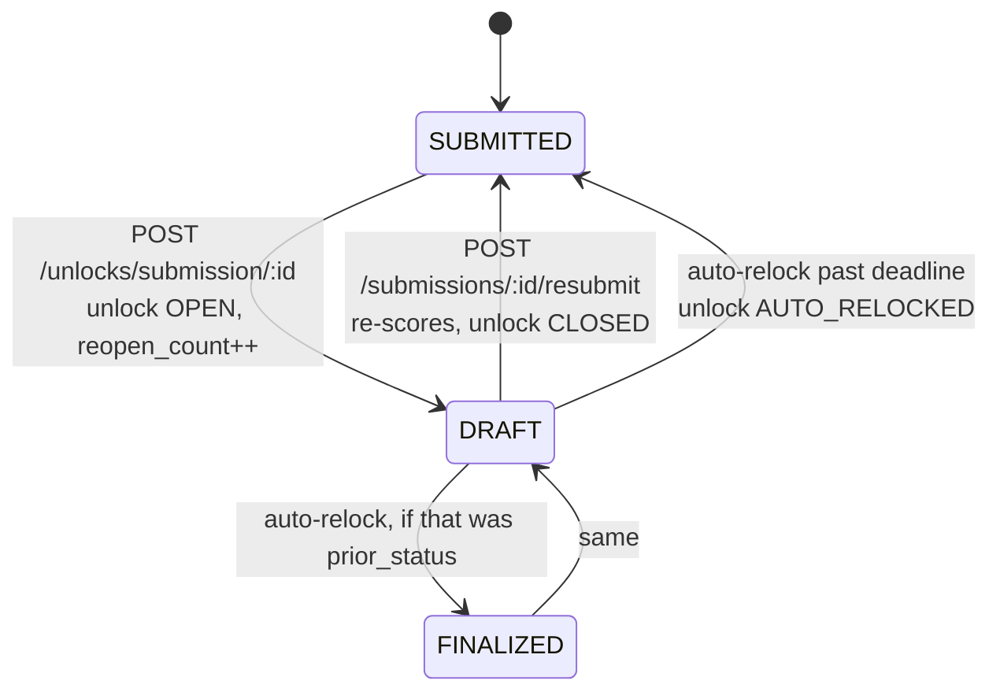

# Unlock / Reopen Flow — Submissions and Disputes

How a closed QA record is reopened, corrected, and closed again. There are
**two independent reopen paths** that are easy to confuse, and confusing them
is the single biggest source of bug reports in this area.

| Path | Reopens | Submission status becomes | `record_unlock.entity_type` | Audit form editable? |
| --- | --- | --- | --- | --- |
| Reopen Review | the audit itself | `DRAFT` | `SUBMISSION` | Yes |
| Reopen Dispute | only the dispute | `DISPUTED` | `DISPUTE` | No |

Reopening a dispute never unlocks the audit form. The agent edits the dispute
reason; a manager or admin re-decides it in Resolution Mode on the submission
detail page. Because a reviewer asking to "reopen" a disputed record almost
always means the dispute, `canReopenReview` in
`frontend/src/pages/quality/SubmissionDetailPage.tsx` hides the header's
Reopen Review button whenever `detail.dispute` exists, leaving the dispute
panel's own Reopen as the only path.

## The submission correction loop



Step by step:

1. **Reopen.** `unlockSubmission` (`backend/src/services/unlock/unlock.service.ts`)
   writes a `record_unlock` row with `state = 'OPEN'`, snapshots `prior_status`
   and `prior_score`, sets the submission to `DRAFT`, increments
   `reopen_count`, and writes an audit-log entry. All in one transaction.
   Answers and `total_score` are deliberately left intact so the reviewer edits
   their real work, not a blank form.
2. **Correct.** `UnlockBanner`'s Correct Review button opens the audit form at
   `/app/quality/audit?resumeDraft=<id>`. The form hydrates from
   `GET /api/submissions/:id/draft`.
3. **Re-submit.** `POST /api/submissions/:id/resubmit` requires an OPEN
   `SUBMISSION` unlock, then calls `promoteDraftToSubmitted`, which replaces the
   answers in place, flips the status back to `SUBMITTED`, and recomputes
   `total_score`, `critical_fail_count` and `score_capped` through
   `saveScoreData`. `submitted_at` is preserved, so a correction does not
   restate when the audit happened. The unlock is then closed with
   `new_status` and `new_score`.

The reopen count is **not** decremented on re-submit, so the cap counts total
reopens over a record's life.

## Configuration

Stored in `ie_config`, editable under Admin > System Settings.

| Key | Default | Effect |
| --- | --- | --- |
| `unlock_max_per_record` | 2 | Reopens allowed per record before `REOPEN_CAP_REACHED` |
| `unlock_window_days` | 30 | Age past which a reopen needs explicit confirmation |
| `unlock_relock_days` | 3 | Days a reopen stays open before auto-relock |

## Auto-relock

A sweep runs every 15 minutes (60-second warmup after boot) over
`record_unlock` rows where `state = 'OPEN'` and `relock_due_at` has passed.
For a `SUBMISSION` unlock it restores `prior_status` **only if the submission
is still `DRAFT`**; for a `DISPUTE` unlock it restores the dispute from
`prior_snapshot` and sets the submission to `FINALIZED`. Either way the unlock
row moves to `AUTO_RELOCKED` with a `closed_at`. It sets no `new_status` or
`new_score`, and never decrements `reopen_count`.

## 409 responses — what each one means

**409 is not an error in this flow.** It is the server reporting a conflict
with the record's current state, and every one of these is caught and turned
into UI. Chrome logs all non-2xx responses in red regardless, so a working
guard rail looks alarming in the console. Judge behaviour by the screen, not
by the network tab.

### `POST /api/unlocks/submission/:id`

| Code | Trigger | UI |
| --- | --- | --- |
| `ALREADY_DRAFT` | Submission is already `DRAFT` | Red message in the reopen dialog |
| `USE_DISPUTE_UNLOCK` | Submission is `DISPUTED` | Red message: resolve or reopen the dispute instead |
| `REOPEN_CAP_REACHED` | `reopen_count >= unlock_max_per_record` | Red message naming the cap |
| `BEYOND_WINDOW` | Older than `unlock_window_days` and no `confirm_beyond_window` | Amber break-glass panel with a Reopen anyway button, which retries with the flag set |

`BEYOND_WINDOW` is the one you will hit constantly in dev, because seeded
submissions are months old against a 30-day window. It is a deliberate
two-step confirmation, not a failure.

Also on this endpoint: 403 `ADMIN_ONLY`, 400 `REASON_REQUIRED`, 400
`VALIDATION_ERROR`, 404 `NOT_FOUND`.

### `POST /api/unlocks/dispute/:disputeId`

| Code | Trigger |
| --- | --- |
| `NOT_CLOSED` | Dispute is not `UPHELD` / `REJECTED` / `ADJUSTED` |
| `REOPEN_CAP_REACHED` | Same cap, counted on the dispute |
| `BEYOND_WINDOW` | Window measured from `dispute.resolved_at` |

### `GET /api/submissions/:id/draft`

| Code | Trigger |
| --- | --- |
| `NOT_A_DRAFT` | Status is not `DRAFT` — usually the correction already landed |
| `FORBIDDEN` (403) | Draft belongs to another reviewer and caller is not an admin |

A `NOT_A_DRAFT` here means the editor was opened for a review that is no
longer correctable. `AuditFormPage` redirects to the submission page with
`replace: true` rather than showing an error, so pressing Back after a
successful re-submit lands somewhere useful instead of in a dead editor.

### `POST /api/submissions/:id/resubmit`

| Code | Trigger |
| --- | --- |
| `NOT_UNLOCKED` | No OPEN `SUBMISSION` unlock — nothing to correct |
| `NOT_A_DRAFT` | Status is not `DRAFT` |

## Cache invalidation each step must do

The submission detail page inherits the global five-minute `staleTime` from
`frontend/src/app/queryClient.ts`, so a correction that does not invalidate is
a correction the reader never sees. Its key is
`['submission-detail', id, roleId]` where `id` is the **route param, a
string** — invalidating with a number matches nothing.

| Action | Must invalidate |
| --- | --- |
| Reopen succeeded (`onUnlockSuccess`) | `['submission-detail', id]`, `['submissions']`, `['disputes']`, `['manager-disputes']` |
| Re-submit succeeded (`AuditFormPage`) | `['submission-detail', String(id)]`, `['submission-active-unlock', id]`, `['submissions']`; plus remove `['ai-reviewer-prefill']` |
| Dispute re-decided | `['submission-detail', id]`, `['disputes']`, `['manager-disputes']` |

Dropping `['submission-detail']` after a re-submit was the cause of the
"corrected score never appears and the review looks stuck in draft" report:
the score, the answers and the now-stale unlock banner were all being served
from a cache entry that was still considered fresh. See
[`frontend_query_keys.md`](./frontend_query_keys.md) for the broader key
conventions, including why the trailing `roleId` must not be dropped.

## What a correction shows afterwards

Once the unlock closes, `getLastReopenForSubmission` (in
`unlock.query.service.ts`) returns the most recent non-`OPEN` row from
`record_unlock`, and `ReopenedNotice` renders it under the status header: reopen
date, reason, note, who reopened it, and the `prior_score` → `new_score` move.
It is deliberately **not** read from the Unlock Register endpoint, which is
admin-only: the agent whose score changed is the person with the strongest claim
to see that it changed and why.

**All three detail endpoints must serve it.** The submission detail page fans out
by role — agents hit `/api/csr/audits/:id` (`CSRService.getAuditDetails`),
managers hit `/api/manager/team-audits/:id`
(`getManagerTeamAuditDetails`), everyone else hits `/api/qa/completed/:id`
(`getSubmissionDetail`). Those are three separate services with three separate
payload shapes, so a field added to only one of them silently disappears for two
thirds of the audience. That is why the loader lives in the unlock domain and is
called from all three. `active_unlock` and `reopen_count` are still QA/admin-only
and so the banner and the count pill do not render for agents or managers — a
pre-existing gap of the same shape, worth closing the same way.

Agents get the reason, date, actor and score change but not `reason_note`: that
is free text an admin wrote for the register, not for the reviewee.

The numbers are scoped to **that** reopen, hence the "Score before reopen" label.
On a review reopened more than once, the original score sits further back in the
history than the row being shown.

`UnlockBanner` is the live counterpart (amber, shown while `state = 'OPEN'`);
`ReopenedNotice` is history (white card, shown once it has closed). Both can be
on screen when a review is reopened a second time.

## A correction uses the form version the audit used

Saving a form does not edit it in place. `MySQLFormRepository.updateForm` writes
a **new `forms` row** with `version + 1`, cloning its categories, questions,
rubrics and calibration maps, and leaves the previous row intact. Submissions
keep pointing at the `form_id` they were audited against, so `submissions.form_id`
*is* the version pointer — "No Contact Call Review Form" has eight rows, and its
submissions sit on four of them (24 on v4, 50 on v6, 251 on v7, 261 on v8).

A reopen therefore renders the exact form the reviewer originally filled in:
`getDraftForEdit` returns `submission.form_id` and the audit page loads that id.
Editing the live form later cannot retroactively change an old review or its
score. If a corrected review *looks* like a different form, the cause is metadata
seeding, not versioning — check `buildInitialMetadata` and the agent picker
first.

## Known gaps

**`closeUnlock` sits outside the promote transaction.** It runs *after*
`promoteDraftToSubmitted` returns (`backend/src/routes/submission.routes.ts`).
If the promote commits and the close then fails, the record is left `SUBMITTED`
with an `OPEN` unlock, so it reads as reopened until the auto-relock sweep
clears it. The same split exists on the dispute resolve path. No occurrence has
been observed. Worth folding into a single transaction if it shows up.

**AUTO metadata is preserved on a resume, re-stamped on an AI promote.** Both
are correct, for opposite reasons, and the distinction is easy to break — see
`buildInitialMetadata` in `frontend/src/utils/forms/metadataSeed.ts` and its
tests. Before that split existed, correcting a review overwrote the original
Reviewer Name with the corrector and the original Review Date with today, while
`submitted_at` kept the true date — so the record contradicted itself.
`promoteDraftToSubmitted`'s `preserveSubmittedBy` is the same rule for the
`submitted_by` column. Rows corrected before these fixes still carry the
corrector's name and id; they need a data repair, not a code change.

**A form shows only the fields it defines — the spacer bridge is gone.**
`normalizeFormMetadata` used to rewrite a `SPACER` in the first four slots into a
required "Interaction Date" (DATE), bridging forms that predate the current
default template. The `form_metadata_fields` row kept `field_type = 'SPACER'`
though, and every read path skips `SPACER` — so the reviewer was blocked by a
mandatory field whose value was then discarded. Three active forms were affected:
Contact Call Review, No Contact Call Review, and Tech Ticket Review.

Removing it was safe in both directions. The helper ran at render time on
whichever form was loaded, so it applied identically to a fresh audit and to a
reopen; dropping it changes both equally and cannot desync them. And there was
no data to lose: no submission has ever recorded an Interaction Date or Call Date
value, and the stray values sitting in spacer rows were cleared.

The five reports that read the field by name — the QC KPI interaction block,
`getLowScoringAudits`, the QA and manager audit lists, and writeup search — have
always fallen back to the review date and continue to. A form that wants a real
interaction date should declare one in the form builder, which creates a new
version and leaves existing reviews pinned to theirs.

## Diagnosing a report in this area

Check the database before reading the console; the two disagreeing is itself
the diagnosis.

```sql
SELECT id, status, reopen_count, total_score, submitted_at,
       DATEDIFF(NOW(), submitted_at) AS days_old
FROM submissions WHERE id = ?;

SELECT id, entity_type, state, prior_status, prior_score,
       new_status, new_score, unlocked_at, closed_at, relock_due_at
FROM record_unlock WHERE submission_id = ? ORDER BY id;
```

A `CLOSED` unlock whose `new_score` differs from `prior_score` means the
correction worked. If the screen still shows `prior_score`, it is a cache
problem, not a scoring problem.
